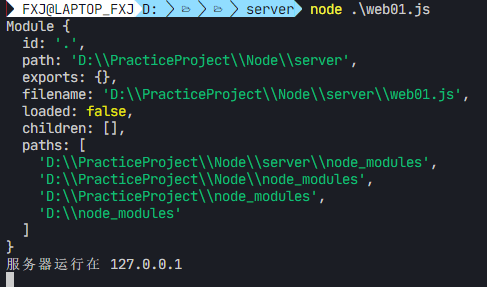
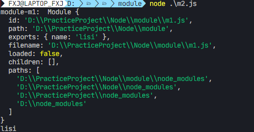
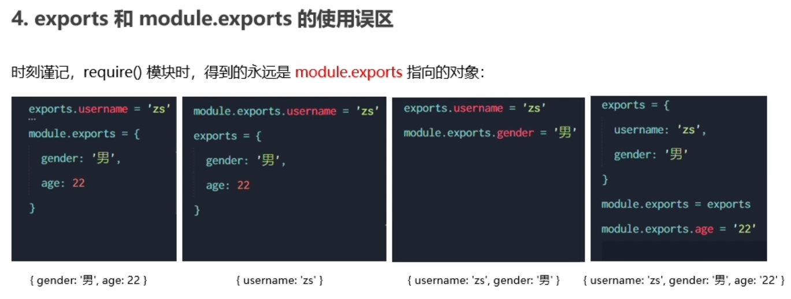
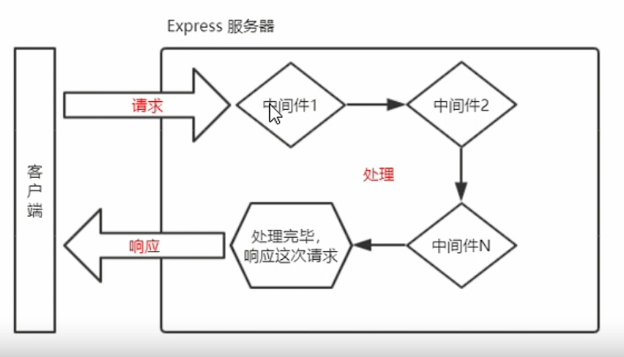
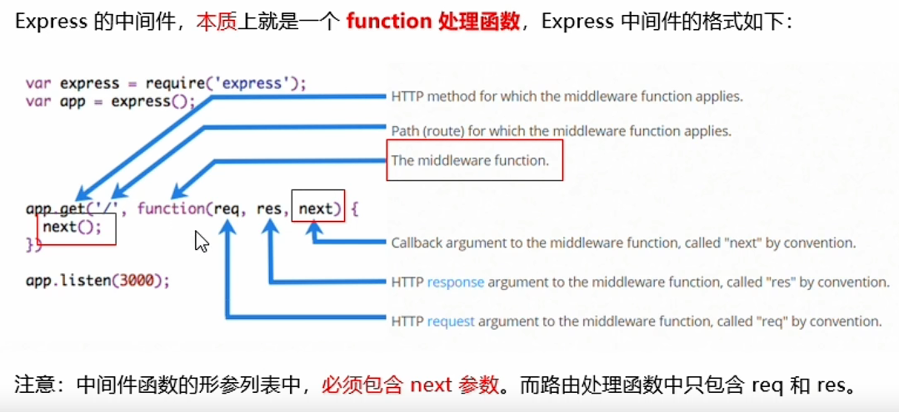
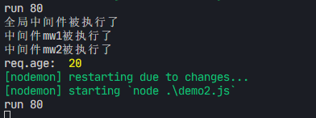
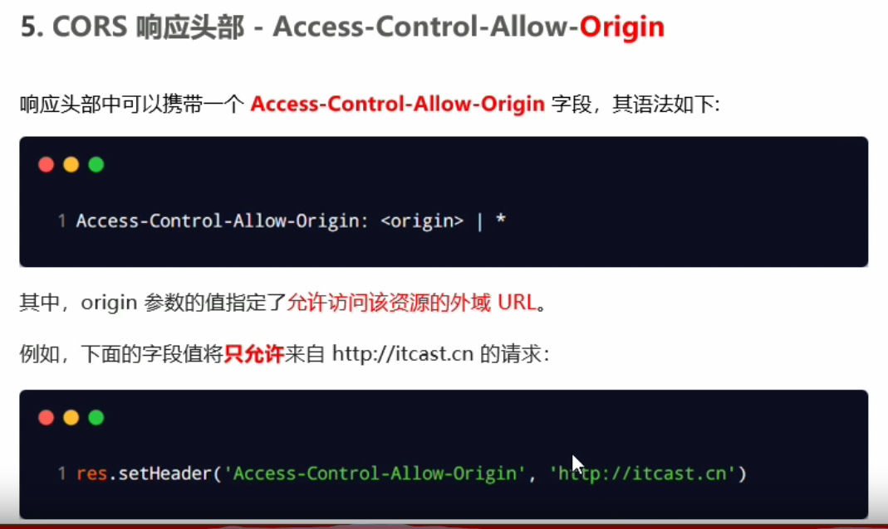
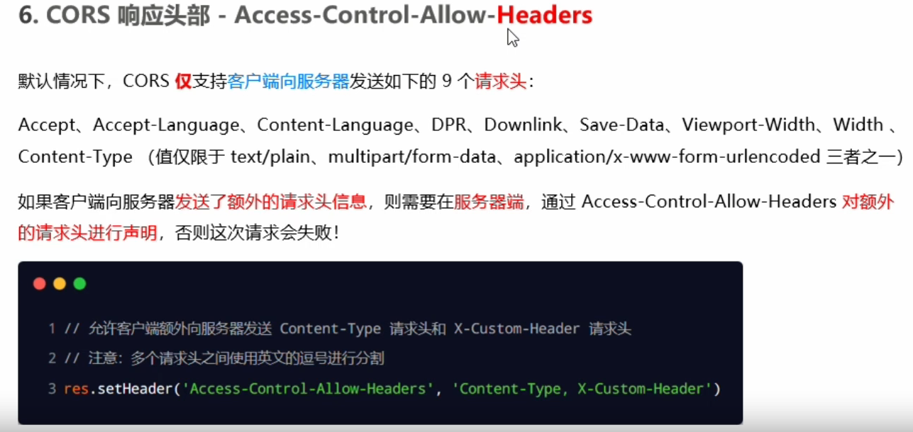
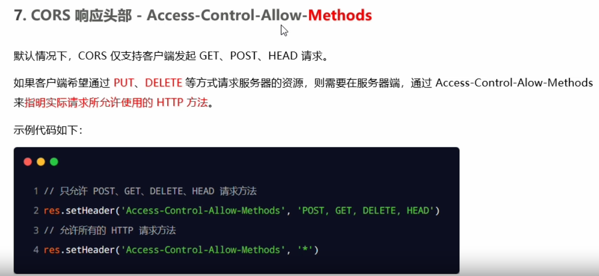
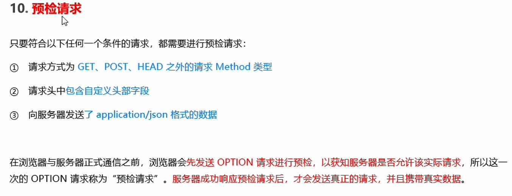

## 一、读取文件

```js
const fs = require('node:fs')
fs.readFile('1.txt', 'utf8', (err, data) => {
  console.log('data: ', data) // 失败为undefined
  console.log('err: ', err) // 成功为null,否则为错误对象

  if (err)
    return console.log(`读取失败${err.message}`)

  console.log(`读取成功${data}`)
})
```

**问题**

- 相对路径在上一层读取不了文件
- 绝对路径不利于维护移植

**解决**

`__dirname`代表当前文件所处目录, 解决文件路径动态拼接问题

**坑点**：`__dirname`输出是路径是**_反斜杠（\）_**，拼接后面的路径需要写**_正斜杠（/）_**

```js
//__dirname:  D:\PracticeProject\Node\readfile

fs.readFile(__dirname + "/3.txt", "utf8", function (err, data) {
  __dirname + "\\\\3.txt",
    __dirname + "\\\3.txt",
    __dirname + "\\\3.txt",
    __dirname + "/\\3.txt",
    console.log("__dirname: ", __dirname + "\\3.txt"); //这四个都可以成功(?)

  console.log("__dirname: ", __dirname);
  console.log("data: ", data);
  if (err) {
    return console.log("读取失败" + err.message);
  }
});
```

### path 路径模块

```js
const pathStr = path.join('/a', '/b/c', '../', '/d') //  a\b\d 抵消路劲(../)
```

获取文件扩展名

```js
const fext = path.extname(fpath)
```

## 二、写入文件

```js
const fs = require('node:fs')
fs.writeFile('F:/12.txt', '888888', (err) => {
  if (err)
    console.log('写入失败 ', err.message)

  // 写入成功,错误为null
  console.log('写入成功')
})
```

> fs.writeFile 只能创建文件，不能创建路径
>
> 重复调用 fs.writeFile 写入同一个文件，新写入的会覆盖之前内容

## 三、服务器操作

> 服务器与普通电脑：服务器上安装了 web 服务器软件

### 1.创建 web 服务器步骤

- 导入 http 模块
- 创建 web 服务器实例
- 为服务器实例绑定 request 事件，监听客户端请求
- 启动服务器

```js
const http = require('node:http')
const server = http.createServer()
server.on('request', (req, res) => {
  // 返回数据给客户端(解决中文乱码两种方法)
  res.writeHead(200, { 'Content-Type': 'text/plain;charset=utf-8' })
  // res.setHeader('Content-Type','text/html; charset=utf-8')
  res.end(`请求url:${req.url},请求方法:${req.method}`)
  console.log('服务器监听到请求')
})
server.listen(80, () => {
  console.log('服务器运行在 127.0.0.1')
})
```

### 2.动态响应内容

```js
const http = require('node:http')
const server = http.createServer()

server.on('request', (req, res) => {
  const url = req.url
  let content = `<h1>Not Found 404</h1>`
  if (url === '/' || url === '/index.html')
    content = `<h1>Home</h1>`
  else if (url === '/about.html')
    content = `<h1>About</h1>`

  res.setHeader('Content-Type', 'text/html; charset=utf-8')
  res.end(content)
})
server.listen(80, () => {
  console.log('运行在localhost:8080')
})
```

### 3.响应文件内容

```js
const http = require('node:http')
const path = require('node:path')
const fs = require('node:fs')

const server = http.createServer()

server.on('request', (req, res) => {
  console.log('请求路径和方式 ', req.url, req.method)
  const fpath = req.url
  // 映射服务器文件路径
  fs.readFile(path.join(__dirname, fpath), 'utf-8', (err, data) => {
    if (err) {
      res.end('<h1>Not Found 404</h1>')
      return console.log('读取失败')
    }
    res.setHeader('Content-Type', 'text/html; charset=utf-8')
    res.end(data)
  })
})

server.listen(8888, () => {
  console.log('服务器运行在localhost:8888')
})
```

**优化访问方式**

```js
const http = require('node:http')
const path = require('node:path')
const fs = require('node:fs')

const server = http.createServer()

server.on('request', (req, res) => {
  console.log('请求路径和方式 ', req.url, req.method)
  const url = req.url
  let fpath = ''

  // 让访问(/,/index.html,/stock-roolup/index.html)都可以得到响应
  if (url === '/')
    fpath = path.join(__dirname, '/stock-rollup/index.html')
  else if (url === '/index.html')
    fpath = path.join(__dirname, '/stock-rollup', url)
  else if (url === '/stock-rollup/index.html')
    fpath = path.join(__dirname, url)

  console.log('fpath: ', fpath)
  fs.readFile(fpath, 'utf-8', (err, data) => {
    if (err) {
      res.end('<h1>Not Found 404</h1>')
      return console.log('读取失败')
    }
    res.setHeader('Content-Type', 'text/html; charset=utf-8')
    res.end(data)
  })
})

server.listen(8888, () => {
  console.log('服务器运行在localhost:8888')
})
```

## 四、Node 模块化

模块分为：内置模块、自定义模块、第三方模块

### 1.module 对象

在自定义模块中，`module.exports`模式是空对象，使用`module.exports`将模块内部成员共享

{data-zoomable}
<!-- {data-zoomable} -->

### 2.模块共享

`m1.js`

```js
const name = 'zhangsan'

module.exports.name = 'lisi'
console.log('module-m1: ', module)
```

`m2.js`

```js
const m1 = require('./m1')
console.log(m1.name)
```

运行: `node m2.js`

{data-zoomable}

导出的对象以`module.expports`为准, 使用`require()`得到的永远是`module.expports`指向的对象

```js
// m1.js
exports.name = 'zhangsan'
exports.age = 18

module.exports = {
  name: 'lisi',
  age: 20,
}
// m2.js
const m1 = require('./m1')
console.log(m1.name) // lisi
console.log(m1.age) // 20
```

{data-zoomable}

## 五、模块加载机制

1. 优先从缓存中加载，模块多次 require()只会执行一次

2. 内置模块的加载优先级是最高的
3. 自定义模块 require 时，必须在路径指定`./或../`开头的路径标识符

{data-zoomable}4. 第三方模块记载机制

{data-zoomable}

5. 目录作为模块

   {data-zoomable}

## 六、Express 模块

**前端两种服务器：**

Web 网站服务器：专门对外提供 Web 网页资源服务器
API 接口服务器：专门对外提供 API 接口服务器

### 1.Express 创建服务器

```js
const express = require('express')
const app = express()

app.get('/zhj', (req, res) => {
  console.log('zhj被访问')
  res.send('zhj被访问哈哈哈')
})
app.listen(80, () => {
  console.log('run 80')
})
```

### 2.Express 中间件

- **概念**

{data-zoomable}

- **定义与使用全局中间件**

  > 可以调用多个中间件对请求进行**_预处理_**

  {data-zoomable}

```js
const express = require('express')
const app = express()

function mw(req, res, next) {
  console.log('全局中间件被执行了')
  req.name = 'zhangsan'
  next()
}
app.use(mw)
app.get('/zjj', (req, res) => {
  console.log('req.name: ', req.name) // zhangsan
  console.log('zjj被访问')
  res.send('zjj被访问哈哈哈')
})
app.listen(80, () => {
  console.log('run 80')
})
```

- **中间件本质**

  next 函数可以流转关系转交给下一个中间件或路由

{data-zoomable}

- **局部中间件**

```js
// ...
function mw1(req, res, next) {
  console.log('中间件mw1被执行了')
  req.age = 18
  next()
}
// 在路由加一个参数,
app.get('/mw1', mw1, (req, res) => {
  console.log('req.age: ', req.age)
  console.log('mw1被访问')
  res.send('mw1被访问哈哈哈')
})
// ...
```

- **多个局部中间件**

```js
const express = require('express')
const app = express()

function mw(req, res, next) {
  console.log('全局中间件被执行了')
  req.name = 'zhangsan'
  next()
}
function mw1(req, res, next) {
  console.log('中间件mw1被执行了')
  req.age = 18
  next()
}
function mw2(req, res, next) {
  console.log('中间件mw2被执行了')
  req.age = 20
  next()
}
app.use(mw)
app.get('/zhj', (req, res) => {
  console.log('req.name: ', req.name)
  console.log('zhj被访问')
  res.send('zhj被访问哈哈哈')
})
// 两种传参方式
app.get('/mw1', [mw1, mw2], (req, res) => {
  // app.get('/mw1',mw1,mw2,(req,res)=>{
  console.log('req.age: ', req.age) // 20
  res.send('mw1被访问哈哈哈')
})
app.listen(80, () => {
  console.log('run 80')
})
```

{data-zoomable}

- **中间件注意事项**

1. 一定要在路由之前注册中间件
2. 可以连续调用多个中间件对请求进行处理
3. 中间件函数必须有`next()`函数
4. `next()`后不要写额外代码
5. 连续调用的多个中间件共享 req 和 res 对象

- **中间件分类**

1. 应用级别中间件：绑定到 app 实例上的中间件
2. 路由级别中间件：绑定到 router 实例上的中间件
3. 错误级别中间件：捕获项目异常错误的中间件

## 七、编写接口

```js
// index.js
const express = require('express')
const router = require('./router')

const app = express()

// 配置解析urlencoded请求体中间件(在路由中间件前使用)
app.use(express.urlencoded({ extended: false }))

// CORS解决跨域
const cors = require('cors')
app.use(cors)

app.use('/api', router)

app.listen(80, () => {
  console.log('server running 127.0.0.1:80')
})
```

```js
// router.js
const express = require('express')
const apiRouter = express.Router()

apiRouter.get('/get', (req, res) => {
  console.log('req.query: ', req.query)
  res.send({
    status: 200,
    message: 'GET 请求成功',
    success: 1,
    data: {
      name: 'zhangsan',
      age: 18,
    },
  })
})
apiRouter.post('/post', (req, res) => {
  console.log('req.body', req.body)
  res.send({
    status: 200,
    message: 'POST 请求成功',
    success: 1,
    data: req.body,
  })
})

module.exports = apiRouter
```

### 1. CORS 跨域资源共享

{data-zoomable}

### 2.CORS 头部

{data-zoomable}

{data-zoomable}

{data-zoomable}


{data-zoomable}

## 八、Node 连接数据库

### 1.配置 mysql 模块

- 安装 mysql 模块：`npm i mysql

- 连接数据库并测试 mysql 是否连接成功

```js
const mysql = require('mysql')

const db = mysql.createPool({
  host: '127.0.0.1',
  user: 'root',
  password: 'root',
  database: 'mydb01',
})

// 测试
db.query('select 1', (err, res) => {
  if (err)
    return console.log(err.message)

  console.log('res: ', res) // res:  [ RowDataPacket { '1': 1 } ]
})
```

### 2.查询数据

```js
// 查询语句
const qstr = 'select * from users'
db.query(qstr, (err, res) => {
  if (err)
    return console.log(err.message)

  console.log('res: ', res)
})
/* 查询结果:
res:  [
  RowDataPacket { id: 1, name: '张三', age: 19 },
  RowDataPacket { id: 2, name: '李四', age: 22 }
]
*/
```

### 3.插入数据

```js
//方式一:
let zl = {
  id: 6,
  name: "zhaoliu",
  age: 21,
};
//占位符的数量和表的列数需要一致,
//否则报错ER_WRONG_VALUE_COUNT_ON_ROW: Column count doesn't match value count at row 1
const istr = `insert into users values(?,?,?)`;
db.query(istr, [zl.id, zl.name, zl.age], (err, res) => {
  if (err) {
    return console.log(err.message);
  }
  console.log("res:", res); //res.affectedRows大于0表示插入成功
});
/* 返回结果:
res: OkPacket {
  fieldCount: 0,
  affectedRows: 1,
  insertId: 3,
  serverStatus: 2,
  warningCount: 0,
  message: '',
  protocol41: true,
  changedRows: 0
}
*/

//方式二:(便捷形式)
const istr = `insert into users set ?`;
db.query(istr, zl, (err, res) => {
  if (err) {
    return console.log(err.message);
  }
  if (res.affectedRows > 0) {
    console.log("插入成功");
  }
});
```

### 4.更新数据

```js
//方式一:
let user = {
  id: 6,
  name: "laoqi",
  age: 30,
};
const ustr = `update  users set name=?,age=? where id=?`;
db.query(ustr, [user.name, user.age, user.id], (err, res) => {
  if (err) {
    return console.log(err.message);
  }
  console.log("res: ", res);
  if (res.affectedRows > 0) {
    console.log("更新成功");
  }
});
//方式二:(便捷形式)
const ustr = `update  users set ? where id=?`;
db.query(ustr, [user, user.id], (err, res) => {
  if (err) {
    return console.log(err.message);
  }
  if (res.affectedRows > 0) {
    console.log("更新成功");
  }
});
```

### 5.删除数据

- 硬删除

```js
const dstr = 'delete from users where id=?'
// 只有一个占位符可省略数组括号
db.query(dstr, 6, (err, res) => {
  if (err)
    return console.log(err.message)

  if (res.affectedRows > 0)
    console.log('硬删除成功')
})
```

- 软删除

```js
const user = {
  id: 2,
  deleted: 1,
}
const dstr = 'update users set ? where id = ?'
db.query(dstr, [user, user.id], (err, res) => {
  if (err)
    return console.log(err.message)

  if (res.affectedRows > 0)
    console.log('软删除成功')
})
```

## 九、身份认证

### 1. http 协议的特性

- **无状态性**：多个请求之间相互独立，服务器不会保留每次 HTTP 请求的状态
- **无连接**：服务器挨个处理访问队列里的访问，处理完一个就关闭连接

### 2.Cookie 特性

- 自动发送
- 域名独立
- 过期时限
- 4KB 限制

> 注意：Cookie 不具有安全性，可以伪造，所以不要用 Cookie 保存隐私数据。

### 3.Session 认证

{data-zoomable}

```js
const express = require('express')
const app = express()

// 配置 Session 中间件
const session = require('express-session')
app.use(
  session({
    secret: 'usersession',
    resave: false,
    saveUninitialized: true,
  })
)

// 托管静态页面
app.use(express.static('./pages'))
// 解析 POST 提交过来的表单数据
app.use(express.urlencoded({ extended: false }))

// 登录的 API 接口
app.post('/api/login', (req, res) => {
  // 判断用户提交的登录信息是否正确
  if (req.body.username !== 'admin' || req.body.password !== '000000')
    return res.send({ status: 1, msg: '登录失败' })

  // 将登录成功后的用户信息，保存到 Session 中(express-session配置后才有)
  req.session.user = req.body // 用户的信息
  req.session.islogin = true // 用户的登录状态

  res.send({ status: 0, msg: '登录成功' })
})

// 获取用户姓名的接口
app.get('/api/username', (req, res) => {
  // 从 Session 中获取用户的名称，响应给客户端
  if (!req.session.islogin)
    return res.send({ status: 1, msg: 'fail' })

  res.send({
    status: 0,
    msg: 'success',
    username: req.session.user.username,
  })
})

// 退出登录的接口
app.post('/api/logout', (req, res) => {
  // 清空 Session 信息
  req.session.destroy()
  res.send({
    status: 0,
    msg: '退出登录成功',
  })
})

// 调用 app.listen 方法，指定端口号并启动web服务器
app.listen(80, () => {
  console.log('Express server running at http://127.0.0.1:80')
})
```

> Session 认证弊端：需要配合 Cookie，Cookie 不支持跨域，需要做额外配置，才能实现跨域 Session 认证。

### 4.JWT 认证

**原理**：服务端通多用户信息生成 Token，发送并保存在客户端，服务器通过还原 Token 来认证用户身份。

{data-zoomable}

JWT 组成部分：Header（头部）、Payload（有效载荷)、Signature（签名）。形式：`Header.Payload.Signature`

{data-zoomable}

**JWT 使用**

安装`jsonwebtoken`、`express-jwt`

```js
const express = require('express')
const app = express()

// 01：安装并导入 JWT 相关的两个包，分别是 jsonwebtoken 和 express-jwt
const jwt = require('jsonwebtoken')
const expressJWT = require('express-jwt')

// 允许跨域资源共享
const cors = require('cors')
app.use(cors())

// 解析 post 表单数据的中间件
const bodyParser = require('body-parser')
app.use(bodyParser.urlencoded({ extended: false }))

// 02：定义 secret 密钥，建议将密钥命名为 secretKey
const secretKey = 'coder8888'

// 04：注册将 JWT 字符串解析还原成 JSON 对象的中间件
// 注意：只要配置成功了 express-jwt 这个中间件，就可以把解析出来的用户信息，挂载到 req.user 属性上
app.use(expressJWT({ secret: secretKey }).unless({ path: [/^\/api\//] }))

// 登录接口
app.post('/api/login', (req, res) => {
  // 将 req.body 请求体中的数据，转存为 userinfo 常量
  const userinfo = req.body
  // 登录失败
  if (userinfo.username !== 'admin' || userinfo.password !== '000000') {
    return res.send({
      status: 400,
      message: '登录失败！',
    })
  }
  // 登录成功
  /* 03：在登录成功之后，调用 jwt.sign() 方法生成 JWT 字符串。并通过 token 属性发送给客户端
   参数1：用户的信息对象
   参数2：加密的秘钥
   参数3：配置对象，可以配置当前 token 的有效期
   记住：千万不要把密码加密到 token 字符中 */
  const tokenStr = jwt.sign({ username: userinfo.username }, secretKey, {
    expiresIn: '30s',
  })
  res.send({
    status: 200,
    message: '登录成功！',
    token: tokenStr, // 要发送给客户端的 token 字符串
  })
})

// 这是一个有权限的 API 接口
app.get('/admin/getinfo', (req, res) => {
  // 05：使用 req.user 获取用户信息，并使用 data 属性将用户信息发送给客户端
  console.log(req.user)
  res.send({
    status: 200,
    message: '获取用户信息成功！',
    data: req.user, // 要发送给客户端的用户信息
  })
})

// 06：使用全局错误处理中间件，捕获解析 JWT 失败后产生的错误
app.use((err, req, res, next) => {
  // 这次错误是由 token 解析失败导致的
  if (err.name === 'UnauthorizedError') {
    return res.send({
      status: 401,
      message: '无效的token',
    })
  }
  res.send({
    status: 500,
    message: '未知的错误',
  })
})

app.listen(8888, () => {
  console.log('Express server running at http://127.0.0.1:8888')
})
```
