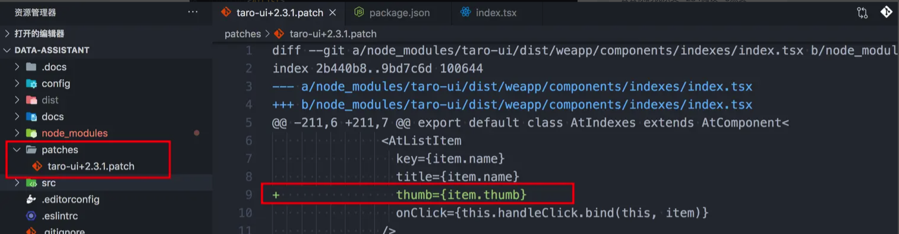

# 如何优雅的修改node_modules中的依赖库

最近使用了一个开源项目，由于业务需要，需要简单的修改 @aaa/bbb源码，package.json如下：

```js
"dependencies": {
    "@aaa/bbb": "^2.0.4",
    "patch-package": "^6.2.0"
}
```

目前比较流量的有两种方案：

1. 使用 webpack alias 实现替换文件
2. 使用 patch-package


个人感觉用 patch-package 会更优雅一点，今天核心也是介绍这种方法

### patch-package
1. 安装

```bash
npm i patch-package 
```

2. 项目的根目录 `package.json` 下，添加 `npm postinstall`，以便每次执行 `npm install` 时能合进所有的 patch 文件

```

  "scripts": {
  	"postinstall": "patch-package" 
  }
```

3. 开开心心修改`node_modules` 目录下依赖库的代码
4. 执行 `npx patch-package <package-name>`

* 如: 修改了taro-ui的 AtIndexs 组件后，执行 `npx patch-package taro-ui`
* 执行完后，会在本地生成一个 `patches` 目录，里面有对应的文件，长这样：



5. `patches`这个目录以及里面的文件可以使用 git 跟踪，分享给团队的其他人

* 当其他人使用 `npm install` 安装第三方依赖库时，patch-package 会根据 `patches`目录下的文件，将你改好的代码同步跟新到 `node_modules` 目录下修改过的依赖库的代码
