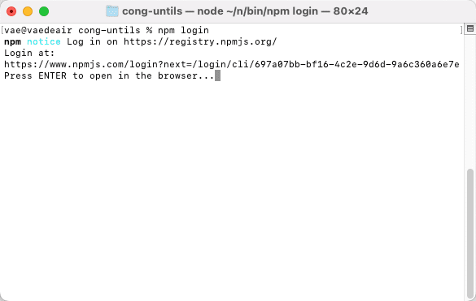
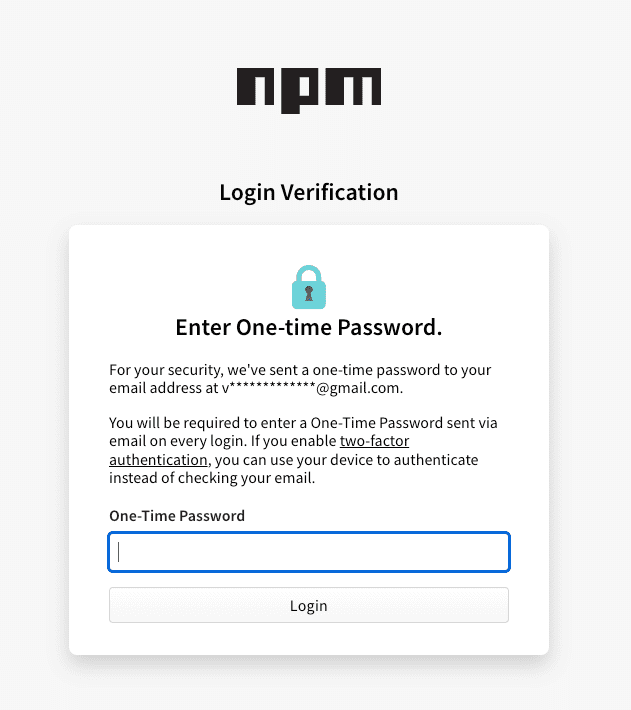

# 如何发布自己的 npm 包(超详细)

## 1. 创建 npm 账号

1. 在 npm 官网 [www.npmjs.com/](https://link.juejin.cn/?target=https%3A%2F%2Fwww.npmjs.com%2F) 注册并创建 npm 账号
2. 注册之后进入新首页 [www.npmjs.com/?track=newU…](https://link.juejin.cn/?target=https%3A%2F%2Fwww.npmjs.com%2F%3Ftrack%3DnewUserCreated)
<!-- 
- It looks like you still do not have two-factor authentication(2FA) enabled on your npm account. To enable 2FA, please follow the instructions fount here（看起来您的 npm 帐户仍未启用双因素身份验证 (2FA)。要启用 2FA，请按照此处的说明进行操作）。
  - 点击[官方英文文档](https://docs.npmjs.com/configuring-two-factor-authentication)去验证，按照文档操作就行
  - [阮一峰 双因素认证（2FA）教程](https://www.ruanyifeng.com/blog/2017/11/2fa-tutorial.html)
  - [5 款好用的 2FA 两步验证工具推荐](https://www.v1tx.com/post/best-2fa-apps/)
  - 总结：认证工具需要科学上网，你懂的，稍微有些麻烦。千万要注意备份，多端通用，不然万一设备出问题了，找不到了，那就麻烦了。所以我暂时先没弄。
- You have not verified yout email address. （您尚未验证您的电子邮件地址）
  - 点击这个提示，就会向邮箱发送验证邮件，在邮箱中操作即可 -->


## 2. 创建 npm 包

> 先拿一个 utils 工具文件尝试，放入一些常用的工具函数，如手机号校验、金额格式化等

1. 新建一个文件夹(cong-utils)
2. 进入文件夹，运行`npm init -y`命令，最后会生成一个 package.json 文件，之后也可以随时改。
3. 详细介绍可查看：[npm Docs 之 package.json](https://docs.npmjs.com/cli/v8/configuring-npm/package-json)

```json
{
  "name": "cong-utils", // 包名，必须要独一无二
  "version": "1.0.0", // 版本号
  "author": "xxx", // 作者
  "description": "common toolkit", // 描述信息
  "keywords": ["utils", "format", "money", "phone"], // 关键词，提升SEO
  "repository": {
    // 代码托管位置
    "type": "git",
    "url": "https://github.com/xxx/cong-utils"
  },
  "license": "ISC", // 许可证
  "homepage": "https://your-package.org", // 包的主页或者文档首页
  "bugs": "https://github.com/xxx/cong-utils/issues", // 用户问题反馈地址
  "main": "index.js", // 入口文件
  "scripts": {
    // 存放可执行脚本
    "test": "echo \"Error: no test specified\" && exit 1"
  },
  "dependencies": {
    // 运行依赖
  },
  "devDependencies": {
    // 开发依赖
  }
}
```

4.完成工具函数文件

```js
// a. index.js 入口文件
import Format from "./src/format";
import Validate from "./src/validate";

export { Format, Validate };

// b. format.js 格式化文件
const Validate = {
  /**
   * 手机号校验
   */
  mobileCheck: (value) => /^[1][3,4,5,7,8][0-9]{9}$/.test(value),

  /**
   * 身份证校验
   */
  IDCardCheck: (value) =>
    /^[1-9]\d{5}(18|19|([23]\d))\d{2}((0[1-9])|(10|11|12))(([0-2][1-9])|10|20|30|31)\d{3}[0-9Xx]$/.test(
      value
    ),

  /**
   * 邮箱校验
   */
  emailCheck: (value) =>
    /^([A-Za-z0-9_\-\.])+\@([A-Za-z0-9_\-\.])+\.([A-Za-z]{2,4})$/.test(value),
};

export default Validate;


// c. validate.js 校验文件
// 解决toFixed保留小数的问题
const formatToFixed = (money, decimals = 2) => {
    return (
      Math.round(
        (parseFloat(money) + Number.EPSILON) * Math.pow(10, decimals)
      ) / Math.pow(10, decimals)
    ).toFixed(decimals);
  }
const Format = {
  // 格式化金额展示： 12341234.246 -> $ 12,341,234.25
  formatMoney: (money, symbol = "", decimals = 2) =>
    formatToFixed(money, decimals)
      .replace(/\B(?=(\d{3})+\b)/g, ",")
      .replace(/^/, `${symbol}`),
};

export default Format;
```


## 3.npm 包上传 Github

1. Github 上创建新仓库`cong-utils`
2. 按照说明文档，上传项目，并初始化本地分支

```bash
git init
git add .
git commit -m "first commit"
git branch -M master
git remote add origin git@github.com:xxx/cong-utils.git
git push -u origin master
```


## 4. npm 包发布

1. 检查 npm 源，如果是淘宝源，则需要改回 npm 源


```js
// 查看npm镜像源地址
npm config get registry

// 设置npm镜像源为淘宝源
npm config set registry https://registry.npmmirror.com

// 设置npm镜像源为默认源
npm config set registry https://registry.npmjs.org/
```
注意：淘宝原镜像域名（registry.npm.taobao.org）的 HTTPS 证书正式到期，彻底不能用了，新地址为`https://registry.npmjs.org`

1. 在终端中切换到项目目录下，运行登陆命令，之后按照终端提示输入用户名、密码等信息即可






1. 运行发布命令

```bash
// 发布命令
npm publish
```

我这个工具函数比较简单，一下就发布成功了，没有碰到其他问题。发布成功后，就可以登陆 npm 网站，查看发布包的情况了


## 5. npm 包使用

```js
npm install cong-utils
```

使用举例

```js
// 导出方式
export { Format, Validate };

// 使用方式
import { Format, Validate } from "cong-utils";
Format.formatMoney(12341234.246, "$", 2); // $12,341,234.25
Validate.mobileCheck("123456"); // false
```

## 6. 更新 npm 包

如下所示：更新了一下说明文档，重新发布

```js
// 自动更改版本号，并且commit
// npm version xxx

// 控制台会返回下一个小版本号 如v1.0.1
npm version patch

// 重新发布
npm publish
```

npm version详解  

```js
// patch：补丁号，修复bug，小变动，如 v1.0.0->v1.0.1
npm version patch

// minor：次版本号，增加新功能，如 v1.0.0->v1.1.0
npm version minor

// major：主版本号，不兼容的修改，如 v1.0.0->v2.0.0
npm version major
```

